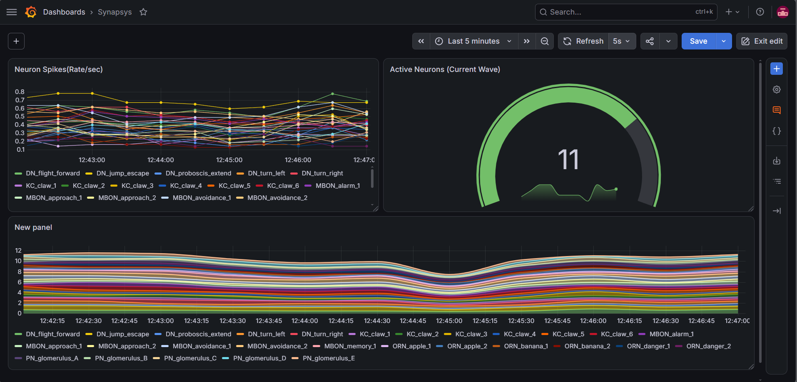

> 🚀 **Looking for the distributed, multi-node mesh architecture?**  
> Check out **[FlyOps-2.0](https://github.com/Rasl37/FlyOps-2.0)** — a resilient 19-neuron connectome cluster featuring dynamic L7 failover, CoreDNS discovery, and Grafana Node Graph visualization.

[English](README.md) | [Русский](README.ru.md)

# Drosophila Connectome Simulator & Observability Stack

A cloud-native demo project: a Python microservice simulating spike propagation dynamics across a biological connectome graph of *Drosophila melanogaster*. The service is containerized, deployed to a local Kubernetes cluster (Minikube), and monitored using the Prometheus Operator and Grafana.



## Overview
* **Microservice (Python):** Simulates neural spike dynamics across biological graph layers (ORN, PN, KC, MBON, DN), calculates synapse latency, and exposes OpenMetrics via `prometheus_client`.
* **Containerization & Orchestration:** Packaged via Docker, deployed to Minikube using declarative manifests (`Deployment`, `ClusterIP Service`).
* **Monitoring (Prometheus Operator):** Target discovery and metric collection automated via Kubernetes Custom Resource Definition (`ServiceMonitor`).
* **Visualization (Grafana & PromQL):** Dashboards configured to track spike rates, p95 latency, and active neuron clusters.

## Architecture

```text
[ Synapses CSV ] ──> [ Python Simulator Pod ] ──(Exposes :8000/metrics)
                             ▲
                             │ Scrapes every 5s
                    [ ServiceMonitor (CRD) ]
                             │
                  [ Prometheus Operator ] ──> [ Grafana Dashboard ]
```

### Graph Model & Tech Stack

The simulation parses `synapses.csv` across functional biological layers:
* **ORN:** Olfactory Receptor Neurons (Sensory input)
* **PN:** Projection Neurons
* **KC:** Kenyon Cells (Pattern recognition)
* **MBON:** Mushroom Body Output Neurons
* **DN:** Descending Neurons (Motor commands)

**Core Stack:** Python 3.11, Docker, Minikube (Kubernetes), CoreOS Prometheus Operator, Grafana.

